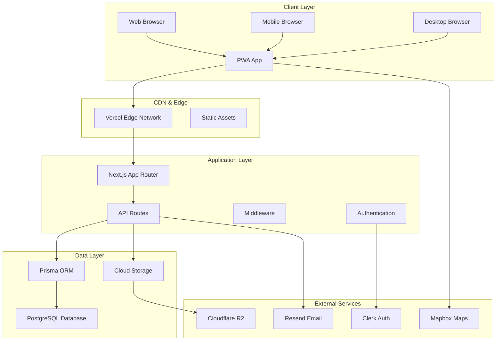
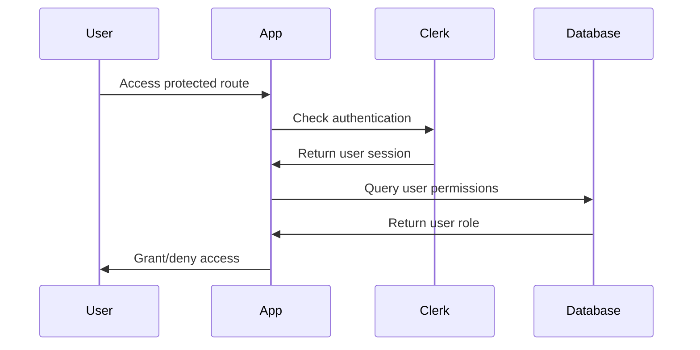
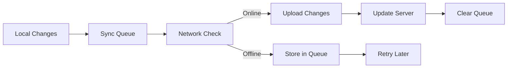
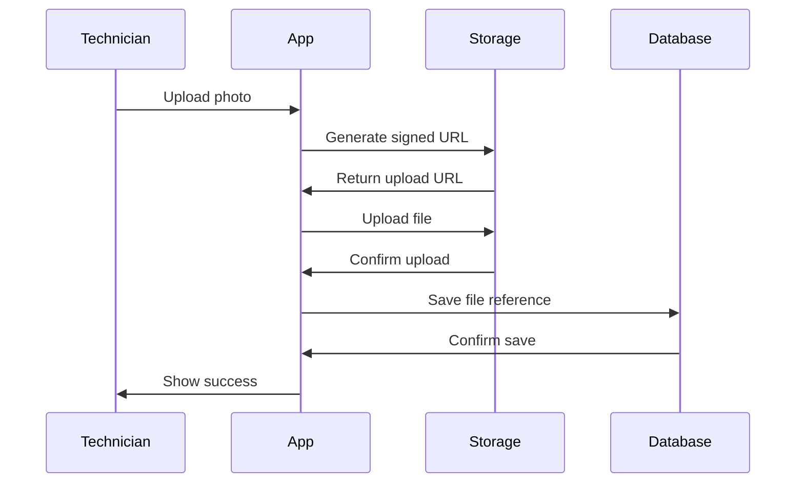

# Battery Technologies - System Architecture

## Overview

The Battery Technologies application is a modern, cloud-native field service management system built with Next.js 14+ and deployed on Vercel. The architecture follows a serverless, event-driven pattern optimized for scalability, offline capabilities, and mobile-first user experience.

## High-Level Architecture



## System Components

### 1. Frontend Architecture

#### 1.1 Next.js App Router
- **Framework**: Next.js 14+ with App Router
- **Language**: TypeScript (strict mode)
- **Styling**: Tailwind CSS v4
- **State Management**: React Context + Local State
- **PWA**: Service Worker with offline capabilities

#### 1.2 Component Architecture
```
src/
├── app/                    # App Router pages
│   ├── (auth)/            # Authentication routes
│   ├── dashboard/         # Main dashboard
│   ├── jobs/              # Job management
│   ├── customers/         # Customer management
│   └── technician/        # Technician interface
├── components/            # Reusable components
│   ├── ui/               # Base UI components
│   ├── forms/            # Form components
│   └── layout/           # Layout components
├── lib/                  # Utility functions
└── types/                # TypeScript definitions
```

#### 1.3 Progressive Web App (PWA)
- **Service Worker**: Offline functionality and caching
- **Manifest**: App installation and branding
- **Offline Storage**: IndexedDB for local data persistence
- **Background Sync**: Queue operations for when online

### 2. Backend Architecture

#### 2.1 API Layer
- **Framework**: Next.js API Routes
- **Runtime**: Node.js (serverless functions)
- **Authentication**: Clerk integration
- **Validation**: Zod schema validation
- **Error Handling**: Centralized error management

#### 2.2 Database Architecture
- **Database**: PostgreSQL (Neon)
- **ORM**: Prisma
- **Migrations**: Version-controlled schema changes
- **Connection Pooling**: Optimized for serverless

#### 2.3 Data Models
```prisma
model User {
  id        String   @id @default(cuid())
  email     String   @unique
  name      String?
  role      UserRole
  createdAt DateTime @default(now())
  updatedAt DateTime @updatedAt
  
  // Relations
  jobs      Job[]
  customers Customer[]
}

model Customer {
  id          String         @id @default(cuid())
  name        String
  email       String
  phone       String?
  type        CustomerType
  locations   Location[]
  jobs        Job[]
  contacts    Contact[]
  createdAt   DateTime       @default(now())
  updatedAt   DateTime       @updatedAt
}

model Job {
  id              String      @id @default(cuid())
  jobNumber       String      @unique
  title           String
  description     String?
  status          JobStatus
  serviceType     ServiceType
  scheduledDate   DateTime?
  completedDate   DateTime?
  customerId      String
  technicianId    String?
  photos          JobPhoto[]
  createdAt       DateTime    @default(now())
  updatedAt       DateTime    @updatedAt
  
  // Relations
  customer        Customer    @relation(fields: [customerId], references: [id])
  technician      User?       @relation(fields: [technicianId], references: [id])
}
```

### 3. Authentication & Authorization

#### 3.1 Authentication Flow


#### 3.2 Role-Based Access Control
- **Admin**: Full system access, user management
- **Technician**: Job access, customer information, offline capabilities
- **Service Provider**: Limited job access, service area restrictions

### 4. Offline Architecture

#### 4.1 Offline-First Design
- **Service Worker**: Intercepts network requests
- **IndexedDB**: Local data storage
- **Background Sync**: Queue operations for sync
- **Conflict Resolution**: Last-write-wins with user notification

#### 4.2 Data Synchronization


### 5. File Storage Architecture

#### 5.1 Cloud Storage
- **Primary**: Cloudflare R2 (S3-compatible)
- **CDN**: Vercel Edge Network
- **Optimization**: Image compression and resizing
- **Security**: Signed URLs for secure access

#### 5.2 File Upload Flow


### 6. Real-time Features

#### 6.1 WebSocket Integration
- **Connection**: WebSocket for real-time updates
- **Events**: Job status changes, new assignments
- **Fallback**: Polling for offline scenarios

#### 6.2 Push Notifications
- **Service Worker**: Handle push notifications
- **Triggers**: New job assignments, status updates
- **Personalization**: Role-based notification preferences

## Deployment Architecture

### 1. Vercel Deployment

#### 1.1 Serverless Functions
- **Runtime**: Node.js 20+
- **Regions**: Global edge deployment
- **Scaling**: Automatic based on demand
- **Cold Start**: Optimized with connection pooling

#### 1.2 Static Assets
- **CDN**: Vercel Edge Network
- **Caching**: Aggressive caching for static content
- **Compression**: Gzip/Brotli compression
- **Image Optimization**: Next.js Image component

### 2. Database Deployment

#### 2.1 Neon PostgreSQL
- **Hosting**: Serverless PostgreSQL
- **Scaling**: Automatic scaling based on usage
- **Backups**: Automated daily backups
- **Branching**: Database branching for development

#### 2.2 Connection Management
- **Pooling**: Prisma connection pooling
- **Timeouts**: Optimized for serverless
- **Retries**: Exponential backoff for failures

### 3. Environment Configuration

#### 3.1 Environment Variables
```bash
# Database
DATABASE_URL="postgresql://..."

# Authentication
NEXT_PUBLIC_CLERK_PUBLISHABLE_KEY="pk_..."
CLERK_SECRET_KEY="sk_..."

# Storage
R2_ACCESS_KEY_ID="..."
R2_SECRET_ACCESS_KEY="..."
R2_BUCKET_NAME="..."
R2_ENDPOINT="..."

# Email
RESEND_API_KEY="..."

# Maps
NEXT_PUBLIC_MAPBOX_TOKEN="..."
```

#### 3.2 Environment Separation
- **Development**: Local development with staging database
- **Preview**: Vercel preview deployments
- **Production**: Production database and services

## Security Architecture

### 1. Authentication Security
- **Provider**: Clerk (enterprise-grade)
- **Sessions**: Secure HTTP-only cookies
- **CSRF**: Built-in CSRF protection
- **Rate Limiting**: API rate limiting

### 2. Data Security
- **Encryption**: TLS 1.3 in transit
- **Database**: Encrypted at rest
- **Secrets**: Environment variable management
- **Access Control**: Role-based permissions

### 3. API Security
- **Validation**: Input validation with Zod
- **Sanitization**: XSS protection
- **CORS**: Configured CORS policies
- **Headers**: Security headers middleware

## Performance Architecture

### 1. Frontend Performance
- **Code Splitting**: Automatic route-based splitting
- **Lazy Loading**: Component and image lazy loading
- **Caching**: Aggressive browser caching
- **PWA**: Offline-first approach

### 2. Backend Performance
- **Serverless**: Auto-scaling functions
- **Database**: Connection pooling and query optimization
- **CDN**: Global edge distribution
- **Caching**: Redis for session storage

### 3. Monitoring & Observability
- **Metrics**: Vercel Analytics
- **Logging**: Structured logging
- **Error Tracking**: Sentry integration
- **Performance**: Core Web Vitals monitoring

## Scalability Considerations

### 1. Horizontal Scaling
- **Serverless**: Automatic scaling
- **Database**: Read replicas for read-heavy operations
- **CDN**: Global edge distribution
- **Storage**: Distributed file storage

### 2. Vertical Scaling
- **Database**: Connection pooling optimization
- **Functions**: Memory and timeout optimization
- **Caching**: Multi-layer caching strategy

### 3. Load Handling
- **Peak Loads**: Auto-scaling serverless functions
- **Database**: Connection pooling and query optimization
- **Storage**: CDN for static assets
- **Offline**: Graceful degradation

## Disaster Recovery

### 1. Data Backup
- **Database**: Automated daily backups
- **Files**: Cross-region replication
- **Code**: Git repository backup
- **Configuration**: Environment variable backup

### 2. Recovery Procedures
- **Database**: Point-in-time recovery
- **Application**: Blue-green deployment
- **Files**: Cross-region failover
- **Monitoring**: Automated alerting

## Technology Stack Summary

### Frontend
- **Framework**: Next.js 14+ (App Router)
- **Language**: TypeScript
- **Styling**: Tailwind CSS v4
- **State**: React Context + Local State
- **PWA**: Service Worker + IndexedDB

### Backend
- **Runtime**: Node.js (Vercel Functions)
- **API**: Next.js API Routes
- **Database**: PostgreSQL (Neon)
- **ORM**: Prisma
- **Authentication**: Clerk

### Infrastructure
- **Hosting**: Vercel
- **Database**: Neon PostgreSQL
- **Storage**: Cloudflare R2
- **CDN**: Vercel Edge Network
- **Monitoring**: Vercel Analytics + Sentry

### Development
- **Testing**: Jest + Playwright
- **Linting**: ESLint + Prettier
- **CI/CD**: GitHub Actions
- **Deployment**: Vercel Git integration

## Future Architecture Considerations

### 1. Microservices Migration
- **API Gateway**: Centralized API management
- **Service Decomposition**: Domain-based services
- **Event Sourcing**: Event-driven architecture
- **Message Queues**: Async processing

### 2. Advanced Features
- **Real-time**: WebSocket integration
- **AI/ML**: Predictive analytics
- **IoT**: Device integration
- **Mobile**: Native app development

### 3. Performance Optimization
- **Edge Computing**: Edge functions
- **GraphQL**: Efficient data fetching
- **Caching**: Multi-layer caching
- **Optimization**: Advanced performance tuning

---

*Document Version: 1.0*  
*Last Updated: [Current Date]*  
*Next Review: [Review Date]*