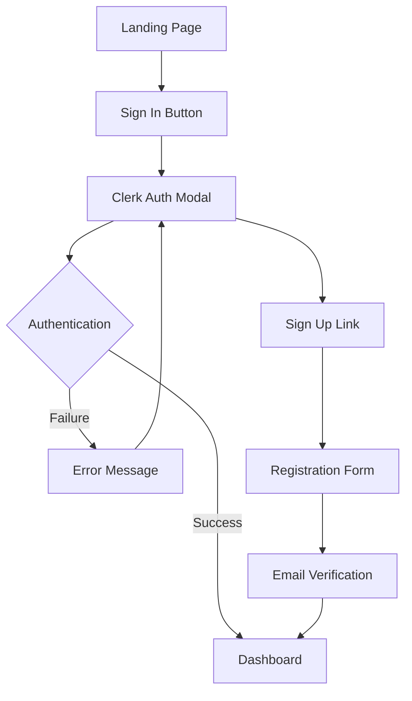
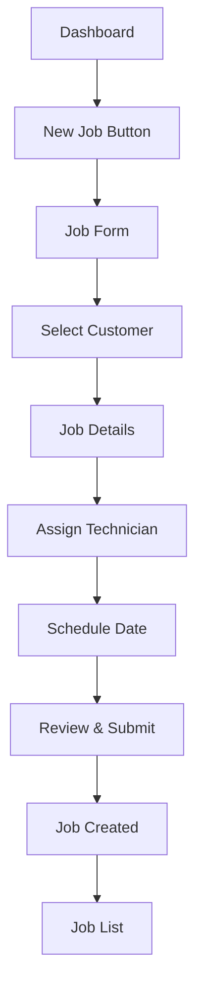
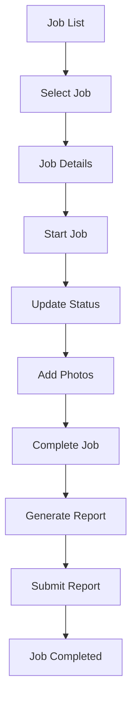
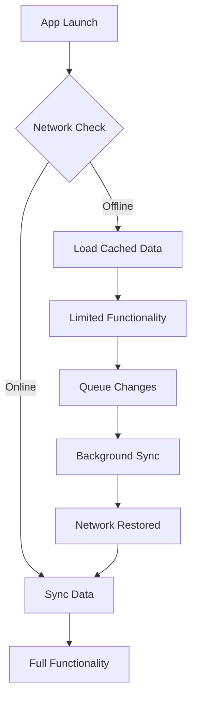

# Battery Technologies - Design Document

## Overview

This document outlines the design patterns, UI/UX principles, component architecture, and user experience flows for the Battery Technologies field service management application. The design follows modern web standards with a mobile-first approach optimized for field technicians.

## Design Principles

### 1. Mobile-First Design
- **Primary Platform**: Mobile devices (phones/tablets)
- **Touch-Friendly**: Large touch targets (44px minimum)
- **Responsive**: Adapts to all screen sizes
- **Offline-Capable**: Works without internet connection

### 2. User Experience Principles
- **Simplicity**: Clean, uncluttered interfaces
- **Efficiency**: Minimal taps to complete tasks
- **Consistency**: Uniform design patterns throughout
- **Accessibility**: WCAG AA compliance
- **Performance**: Fast loading and smooth interactions

### 3. Visual Design Principles
- **Modern**: Contemporary design language
- **Professional**: Business-appropriate aesthetics
- **Branded**: Consistent with company identity
- **Readable**: High contrast and clear typography

## Design System

### 1. Color Palette

#### Primary Colors
```css
:root {
  /* Primary Brand Colors */
  --primary-50: #eff6ff;
  --primary-100: #dbeafe;
  --primary-500: #3b82f6;
  --primary-600: #2563eb;
  --primary-700: #1d4ed8;
  --primary-900: #1e3a8a;
  
  /* Secondary Colors */
  --secondary-50: #f0fdf4;
  --secondary-100: #dcfce7;
  --secondary-500: #22c55e;
  --secondary-600: #16a34a;
  --secondary-700: #15803d;
  
  /* Neutral Colors */
  --gray-50: #f9fafb;
  --gray-100: #f3f4f6;
  --gray-200: #e5e7eb;
  --gray-300: #d1d5db;
  --gray-400: #9ca3af;
  --gray-500: #6b7280;
  --gray-600: #4b5563;
  --gray-700: #374151;
  --gray-800: #1f2937;
  --gray-900: #111827;
}
```

#### Status Colors
```css
:root {
  /* Success */
  --success-50: #f0fdf4;
  --success-500: #22c55e;
  --success-600: #16a34a;
  
  /* Warning */
  --warning-50: #fffbeb;
  --warning-500: #f59e0b;
  --warning-600: #d97706;
  
  /* Error */
  --error-50: #fef2f2;
  --error-500: #ef4444;
  --error-600: #dc2626;
  
  /* Info */
  --info-50: #eff6ff;
  --info-500: #3b82f6;
  --info-600: #2563eb;
}
```

### 2. Typography

#### Font Stack
```css
:root {
  --font-sans: 'Inter', -apple-system, BlinkMacSystemFont, 'Segoe UI', Roboto, sans-serif;
  --font-mono: 'JetBrains Mono', 'Fira Code', Consolas, monospace;
}
```

#### Type Scale
```css
:root {
  /* Font Sizes */
  --text-xs: 0.75rem;    /* 12px */
  --text-sm: 0.875rem;   /* 14px */
  --text-base: 1rem;     /* 16px */
  --text-lg: 1.125rem;   /* 18px */
  --text-xl: 1.25rem;    /* 20px */
  --text-2xl: 1.5rem;    /* 24px */
  --text-3xl: 1.875rem;  /* 30px */
  --text-4xl: 2.25rem;   /* 36px */
  
  /* Line Heights */
  --leading-tight: 1.25;
  --leading-normal: 1.5;
  --leading-relaxed: 1.625;
}
```

### 3. Spacing System

#### Spacing Scale
```css
:root {
  --space-1: 0.25rem;   /* 4px */
  --space-2: 0.5rem;    /* 8px */
  --space-3: 0.75rem;   /* 12px */
  --space-4: 1rem;      /* 16px */
  --space-5: 1.25rem;   /* 20px */
  --space-6: 1.5rem;    /* 24px */
  --space-8: 2rem;      /* 32px */
  --space-10: 2.5rem;   /* 40px */
  --space-12: 3rem;     /* 48px */
  --space-16: 4rem;     /* 64px */
  --space-20: 5rem;     /* 80px */
  --space-24: 6rem;     /* 96px */
}
```

### 4. Border Radius
```css
:root {
  --radius-sm: 0.125rem;   /* 2px */
  --radius-md: 0.375rem;   /* 6px */
  --radius-lg: 0.5rem;     /* 8px */
  --radius-xl: 0.75rem;    /* 12px */
  --radius-2xl: 1rem;      /* 16px */
  --radius-full: 9999px;
}
```

### 5. Shadows
```css
:root {
  --shadow-sm: 0 1px 2px 0 rgb(0 0 0 / 0.05);
  --shadow-md: 0 4px 6px -1px rgb(0 0 0 / 0.1), 0 2px 4px -2px rgb(0 0 0 / 0.1);
  --shadow-lg: 0 10px 15px -3px rgb(0 0 0 / 0.1), 0 4px 6px -4px rgb(0 0 0 / 0.1);
  --shadow-xl: 0 20px 25px -5px rgb(0 0 0 / 0.1), 0 8px 10px -6px rgb(0 0 0 / 0.1);
}
```

## Component Design

### 1. Button Components

#### Primary Button
```tsx
interface ButtonProps {
  variant?: 'primary' | 'secondary' | 'outline' | 'ghost';
  size?: 'sm' | 'md' | 'lg';
  disabled?: boolean;
  loading?: boolean;
  children: React.ReactNode;
  onClick?: () => void;
}

const Button: React.FC<ButtonProps> = ({
  variant = 'primary',
  size = 'md',
  disabled = false,
  loading = false,
  children,
  onClick
}) => {
  const baseClasses = 'inline-flex items-center justify-center font-medium rounded-lg transition-colors focus:outline-none focus:ring-2 focus:ring-offset-2';
  
  const variantClasses = {
    primary: 'bg-primary-600 text-white hover:bg-primary-700 focus:ring-primary-500',
    secondary: 'bg-secondary-600 text-white hover:bg-secondary-700 focus:ring-secondary-500',
    outline: 'border border-gray-300 bg-white text-gray-700 hover:bg-gray-50 focus:ring-primary-500',
    ghost: 'text-gray-700 hover:bg-gray-100 focus:ring-primary-500'
  };
  
  const sizeClasses = {
    sm: 'px-3 py-2 text-sm',
    md: 'px-4 py-2 text-base',
    lg: 'px-6 py-3 text-lg'
  };
  
  return (
    <button
      className={`${baseClasses} ${variantClasses[variant]} ${sizeClasses[size]} ${disabled ? 'opacity-50 cursor-not-allowed' : ''}`}
      disabled={disabled || loading}
      onClick={onClick}
    >
      {loading && <Spinner className="mr-2" />}
      {children}
    </button>
  );
};
```

### 2. Form Components

#### Input Field
```tsx
interface InputProps {
  label?: string;
  type?: 'text' | 'email' | 'password' | 'number' | 'tel';
  placeholder?: string;
  value: string;
  onChange: (value: string) => void;
  error?: string;
  required?: boolean;
  disabled?: boolean;
}

const Input: React.FC<InputProps> = ({
  label,
  type = 'text',
  placeholder,
  value,
  onChange,
  error,
  required = false,
  disabled = false
}) => {
  return (
    <div className="space-y-2">
      {label && (
        <label className="block text-sm font-medium text-gray-700">
          {label}
          {required && <span className="text-error-500 ml-1">*</span>}
        </label>
      )}
      <input
        type={type}
        placeholder={placeholder}
        value={value}
        onChange={(e) => onChange(e.target.value)}
        disabled={disabled}
        className={`w-full px-3 py-2 border rounded-lg focus:outline-none focus:ring-2 focus:ring-primary-500 focus:border-transparent ${
          error ? 'border-error-500' : 'border-gray-300'
        } ${disabled ? 'bg-gray-100 cursor-not-allowed' : ''}`}
      />
      {error && (
        <p className="text-sm text-error-600">{error}</p>
      )}
    </div>
  );
};
```

### 3. Card Components

#### Job Card
```tsx
interface JobCardProps {
  job: {
    id: string;
    jobNumber: string;
    title: string;
    customer: string;
    status: 'scheduled' | 'in-progress' | 'completed' | 'cancelled';
    scheduledDate: Date;
    serviceType: string;
  };
  onClick?: () => void;
}

const JobCard: React.FC<JobCardProps> = ({ job, onClick }) => {
  const statusColors = {
    scheduled: 'bg-warning-100 text-warning-800',
    'in-progress': 'bg-info-100 text-info-800',
    completed: 'bg-success-100 text-success-800',
    cancelled: 'bg-error-100 text-error-800'
  };
  
  return (
    <div
      className="bg-white rounded-lg border border-gray-200 p-4 shadow-sm hover:shadow-md transition-shadow cursor-pointer"
      onClick={onClick}
    >
      <div className="flex items-start justify-between mb-3">
        <div>
          <h3 className="font-semibold text-gray-900">{job.title}</h3>
          <p className="text-sm text-gray-600">#{job.jobNumber}</p>
        </div>
        <span className={`px-2 py-1 rounded-full text-xs font-medium ${statusColors[job.status]}`}>
          {job.status.replace('-', ' ')}
        </span>
      </div>
      
      <div className="space-y-2">
        <div className="flex items-center text-sm text-gray-600">
          <UserIcon className="w-4 h-4 mr-2" />
          {job.customer}
        </div>
        <div className="flex items-center text-sm text-gray-600">
          <CalendarIcon className="w-4 h-4 mr-2" />
          {format(job.scheduledDate, 'MMM dd, yyyy')}
        </div>
        <div className="flex items-center text-sm text-gray-600">
          <WrenchIcon className="w-4 h-4 mr-2" />
          {job.serviceType}
        </div>
      </div>
    </div>
  );
};
```

## Layout Design

### 1. Main Layout Structure

#### App Layout
```tsx
const AppLayout: React.FC<{ children: React.ReactNode }> = ({ children }) => {
  return (
    <div className="min-h-screen bg-gray-50">
      {/* Header */}
      <header className="bg-white shadow-sm border-b border-gray-200">
        <div className="max-w-7xl mx-auto px-4 sm:px-6 lg:px-8">
          <div className="flex justify-between items-center h-16">
            <div className="flex items-center">
              <Logo className="h-8 w-auto" />
              <h1 className="ml-3 text-xl font-semibold text-gray-900">
                Battery Technologies
              </h1>
            </div>
            <Navigation />
          </div>
        </div>
      </header>
      
      {/* Main Content */}
      <main className="max-w-7xl mx-auto px-4 sm:px-6 lg:px-8 py-8">
        {children}
      </main>
      
      {/* Footer */}
      <footer className="bg-white border-t border-gray-200 mt-auto">
        <div className="max-w-7xl mx-auto px-4 sm:px-6 lg:px-8 py-4">
          <p className="text-center text-sm text-gray-500">
            © 2024 Battery Technologies. All rights reserved.
          </p>
        </div>
      </footer>
    </div>
  );
};
```

### 2. Dashboard Layout

#### Dashboard Grid
```tsx
const DashboardLayout: React.FC = () => {
  return (
    <div className="space-y-6">
      {/* Stats Cards */}
      <div className="grid grid-cols-1 md:grid-cols-2 lg:grid-cols-4 gap-6">
        <StatCard
          title="Total Jobs"
          value="142"
          change="+12%"
          changeType="positive"
          icon={ClipboardIcon}
        />
        <StatCard
          title="Completed"
          value="98"
          change="+8%"
          changeType="positive"
          icon={CheckCircleIcon}
        />
        <StatCard
          title="In Progress"
          value="24"
          change="-3%"
          changeType="negative"
          icon={ClockIcon}
        />
        <StatCard
          title="Scheduled"
          value="20"
          change="+15%"
          changeType="positive"
          icon={CalendarIcon}
        />
      </div>
      
      {/* Main Content Grid */}
      <div className="grid grid-cols-1 lg:grid-cols-3 gap-6">
        {/* Recent Jobs */}
        <div className="lg:col-span-2">
          <RecentJobs />
        </div>
        
        {/* Quick Actions */}
        <div className="lg:col-span-1">
          <QuickActions />
        </div>
      </div>
    </div>
  );
};
```

## User Interface Flows

### 1. Authentication Flow

#### Sign-In Process


### 2. Job Management Flow

#### Job Creation Process


#### Job Execution Flow


### 3. Offline Flow

#### Offline Job Access


## Mobile Design Patterns

### 1. Navigation Patterns

#### Bottom Navigation (Mobile)
```tsx
const MobileNavigation: React.FC = () => {
  return (
    <nav className="fixed bottom-0 left-0 right-0 bg-white border-t border-gray-200 px-4 py-2">
      <div className="flex justify-around">
        <NavItem icon={HomeIcon} label="Dashboard" href="/dashboard" />
        <NavItem icon={ClipboardIcon} label="Jobs" href="/jobs" />
        <NavItem icon={UserGroupIcon} label="Customers" href="/customers" />
        <NavItem icon={UserIcon} label="Profile" href="/profile" />
      </div>
    </nav>
  );
};
```

#### Drawer Navigation (Tablet)
```tsx
const DrawerNavigation: React.FC = () => {
  return (
    <aside className="w-64 bg-white shadow-lg">
      <div className="p-4">
        <Logo className="h-8 w-auto" />
      </div>
      <nav className="mt-8">
        <NavSection title="Main">
          <NavItem icon={HomeIcon} label="Dashboard" href="/dashboard" />
          <NavItem icon={ClipboardIcon} label="Jobs" href="/jobs" />
          <NavItem icon={UserGroupIcon} label="Customers" href="/customers" />
        </NavSection>
        <NavSection title="Tools">
          <NavItem icon={CameraIcon} label="Photo Capture" href="/camera" />
          <NavItem icon={DocumentIcon} label="Reports" href="/reports" />
        </NavSection>
      </nav>
    </aside>
  );
};
```

### 2. Touch Interactions

#### Swipe Gestures
- **Job Cards**: Swipe left to mark complete, swipe right to reschedule
- **Photo Gallery**: Swipe to navigate between photos
- **Navigation**: Swipe from edge to open drawer

#### Touch Targets
- **Minimum Size**: 44px × 44px
- **Spacing**: 8px minimum between targets
- **Visual Feedback**: Hover states and active states

### 3. Form Design

#### Mobile-Optimized Forms
```tsx
const MobileForm: React.FC = () => {
  return (
    <form className="space-y-6 p-4">
      <div className="space-y-4">
        <Input
          label="Job Title"
          placeholder="Enter job title"
          required
        />
        <Select
          label="Service Type"
          options={serviceTypes}
          placeholder="Select service type"
        />
        <DatePicker
          label="Scheduled Date"
          placeholder="Select date"
        />
        <TextArea
          label="Description"
          placeholder="Enter job description"
          rows={4}
        />
      </div>
      
      <div className="flex space-x-3">
        <Button variant="outline" className="flex-1">
          Cancel
        </Button>
        <Button variant="primary" className="flex-1">
          Create Job
        </Button>
      </div>
    </form>
  );
};
```

## Accessibility Design

### 1. WCAG AA Compliance

#### Color Contrast
- **Normal Text**: 4.5:1 minimum contrast ratio
- **Large Text**: 3:1 minimum contrast ratio
- **UI Components**: 3:1 minimum contrast ratio

#### Keyboard Navigation
- **Tab Order**: Logical tab sequence
- **Focus Indicators**: Visible focus states
- **Skip Links**: Skip to main content
- **Keyboard Shortcuts**: Common shortcuts supported

#### Screen Reader Support
- **Semantic HTML**: Proper heading structure
- **ARIA Labels**: Descriptive labels for interactive elements
- **Alt Text**: Descriptive alternative text for images
- **Live Regions**: Announce dynamic content changes

### 2. Inclusive Design

#### Visual Accessibility
- **Font Size**: Minimum 16px for body text
- **Line Height**: 1.5 minimum line height
- **Spacing**: Adequate white space
- **Color Independence**: Information not conveyed by color alone

#### Motor Accessibility
- **Large Touch Targets**: 44px minimum
- **Gesture Alternatives**: Button alternatives for gestures
- **Error Prevention**: Confirmation for destructive actions
- **Undo Functionality**: Ability to undo actions

## Performance Design

### 1. Loading States

#### Skeleton Loading
```tsx
const JobCardSkeleton: React.FC = () => {
  return (
    <div className="bg-white rounded-lg border border-gray-200 p-4 animate-pulse">
      <div className="flex items-start justify-between mb-3">
        <div className="space-y-2">
          <div className="h-4 bg-gray-200 rounded w-3/4"></div>
          <div className="h-3 bg-gray-200 rounded w-1/2"></div>
        </div>
        <div className="h-6 bg-gray-200 rounded-full w-16"></div>
      </div>
      <div className="space-y-2">
        <div className="h-3 bg-gray-200 rounded w-full"></div>
        <div className="h-3 bg-gray-200 rounded w-2/3"></div>
        <div className="h-3 bg-gray-200 rounded w-1/2"></div>
      </div>
    </div>
  );
};
```

#### Progressive Loading
- **Critical Path**: Load essential content first
- **Lazy Loading**: Load non-critical content as needed
- **Image Optimization**: WebP format with fallbacks
- **Code Splitting**: Route-based code splitting

### 2. Error States

#### Error Handling
```tsx
const ErrorBoundary: React.FC<{ children: React.ReactNode }> = ({ children }) => {
  return (
    <ErrorBoundary
      fallback={
        <div className="min-h-screen flex items-center justify-center">
          <div className="text-center">
            <ExclamationTriangleIcon className="mx-auto h-12 w-12 text-error-500" />
            <h3 className="mt-2 text-sm font-medium text-gray-900">
              Something went wrong
            </h3>
            <p className="mt-1 text-sm text-gray-500">
              Please try refreshing the page or contact support.
            </p>
            <div className="mt-6">
              <Button onClick={() => window.location.reload()}>
                Refresh Page
              </Button>
            </div>
          </div>
        </div>
      }
    >
      {children}
    </ErrorBoundary>
  );
};
```

## Design Tokens

### 1. Component Tokens
```json
{
  "button": {
    "height": {
      "sm": "32px",
      "md": "40px",
      "lg": "48px"
    },
    "padding": {
      "sm": "8px 12px",
      "md": "10px 16px",
      "lg": "12px 24px"
    },
    "borderRadius": "8px",
    "fontWeight": "500"
  },
  "input": {
    "height": "40px",
    "padding": "10px 12px",
    "borderRadius": "8px",
    "borderWidth": "1px"
  },
  "card": {
    "borderRadius": "12px",
    "padding": "16px",
    "shadow": "0 1px 3px rgba(0, 0, 0, 0.1)"
  }
}
```

### 2. Animation Tokens
```json
{
  "duration": {
    "fast": "150ms",
    "normal": "300ms",
    "slow": "500ms"
  },
  "easing": {
    "easeIn": "cubic-bezier(0.4, 0, 1, 1)",
    "easeOut": "cubic-bezier(0, 0, 0.2, 1)",
    "easeInOut": "cubic-bezier(0.4, 0, 0.2, 1)"
  }
}
```

## Design Validation

### 1. Usability Testing
- **Task Completion**: Users can complete primary tasks
- **Error Rate**: Low error rates for common actions
- **Satisfaction**: High user satisfaction scores
- **Accessibility**: Meets WCAG AA standards

### 2. Performance Testing
- **Load Time**: Pages load within 3 seconds
- **Interaction**: Smooth 60fps interactions
- **Memory**: Efficient memory usage
- **Battery**: Minimal battery drain on mobile

### 3. Cross-Platform Testing
- **Browsers**: Chrome, Safari, Firefox, Edge
- **Devices**: iOS, Android, Desktop
- **Screen Sizes**: 320px to 2560px width
- **Orientations**: Portrait and landscape

---

*Document Version: 1.0*  
*Last Updated: [Current Date]*  
*Next Review: [Review Date]*